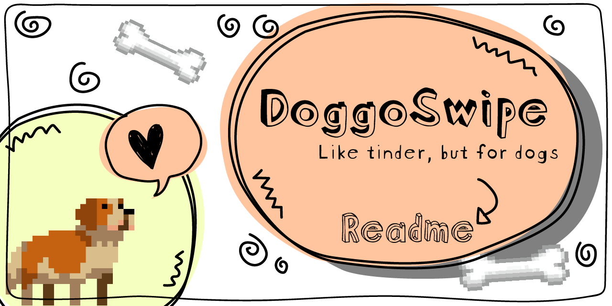
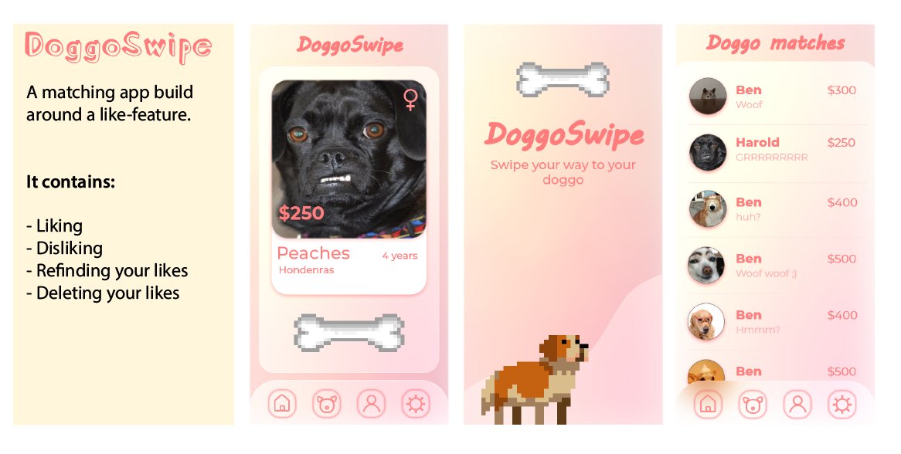

# 🐶 DoggoSwipe

Welcome! This is my code for my school project: project-tech. During this project I will be making one interaction for the DoggoSwipe app. Feel free to look around or check out my [wiki](https://github.com/samanthavz/project-tech/wiki) for more info! (written in dutch).

# 📃 description and concept

 I am making an interaction for a matching app. The concept is like a tinder for dogs and owners. Dogs that have a hard time finding an owner can be signed up by the dog shelter. The next step is for users to start swiping. When they see a dog they like, they can give them a bone (meaning you will like them). When they don't like a dog, they just swipe away. All the liked dogs will be shown in a list. There you can chat with them (totally realistic, right?) and you will be provided with more contact info. The interaction I will be working on is the "liking" interaction.

 I made this app for **mobile screens and tablets** only. It will work on computers, but it is not aesthetically pleasing. If you want to see it in the best way you can, press ```Shift + CTRL + J``` on windows or ```Option + ⌘ + J```. Then click on the mobile icon (device toolbar) and change the phone size to iphone 6 - iphone X.




 ## Build with:
 * [Node.js](https://nodejs.org/en/)
 * [Pug](https://pugjs.org/api/getting-started.html)
 * [Express](https://www.npmjs.com/package/express)

 ---

# 💻 How to install

Want to start up my app and you have no idea how? Follow the next steps! (if you are a pro already, you can skip the pre-installation).
## 🔨 Pre-installation:
#### NODE.js
* [Install NodeJs](https://nodejs.org/en/download/)
* Type ```node install``` in your terminal
* Or use ```node --version``` to check if you have node on your computer

#### GIT
* Type ```git install``` in your terminal
* Or use ```git --version``` to check if you have GIT on your computer

---
## 🔨 App installation:
#### Clone this repo:
* ```git clone https://github.com/samanthavz/project-tech.git```

#### Install NPM:
* [Install NPM](https://www.npmjs.com/get-npm) in the root of the project:
``` npm install ```

#### Start node:
* ```npm start```

---
# 📊 Database

The database used for this app is [MongoDB](https://www.mongodb.com/). The database consist out of collections of dog profiles.

<!-- TODO: data structure diagram -->

---
# 🎫 License

[MIT License](https://github.com/samanthavz/project-tech/blob/master/LICENSE)

---

### 🙋‍♀️ Author: Samantha van Zandwijk


